# Silksong Wish Board Widget

<p align="center">
  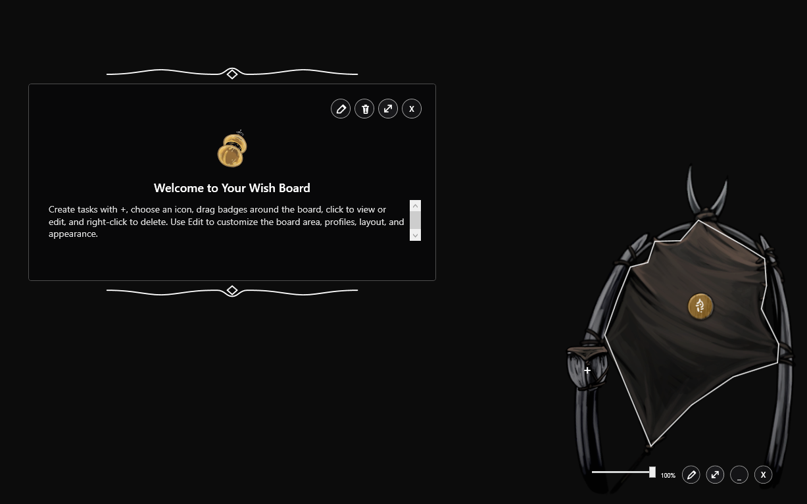
</p>

<p align="center">
  A native Windows desktop widget that turns everyday tasks into animated wishes inspired by the quest boards of <em>Hollow Knight: Silksong</em>.
</p>

<p align="center">
  <strong>Native WPF</strong> · <strong>Three board profiles</strong> · <strong>Smart placement</strong> · <strong>Persistent layout</strong> · <strong>No installation</strong>
</p>

> Double-click **`Desktop Wish Board.vbs`** to start.

## What You Can Do

| Action | How it works |
| --- | --- |
| Add a wish | Click `+`, choose an icon, enter a title and description, then use the disk button. |
| Preview a wish | Hover over a badge to display its ornamented preview at the top center of the widget. |
| Read a wish | Click a badge to open the full detail view. |
| Move a wish | Drag a badge inside the permitted board area. |
| Edit a wish | Open it, select Edit, change its content or icon, and save. |
| Delete a wish | Right-click its badge and select `Delete`, or delete it from the detail view. |
| Customize the board | Enter Edit Mode to change the profile, polygon, border, grid and `+` position. |
| Start with Windows | In Edit Mode, toggle `STARTUP ON/OFF` to add or remove the widget from Windows startup. |
| Resize or fade | Use the resize control and transparency slider in the bottom toolbar. |
| Keep it available | Minimize it to the Windows system tray and restore it when needed. |

## See It in Action

| Desktop board | Fixed hover preview |
| :---: | :---: |
| 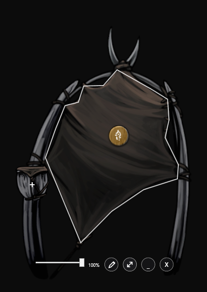 | 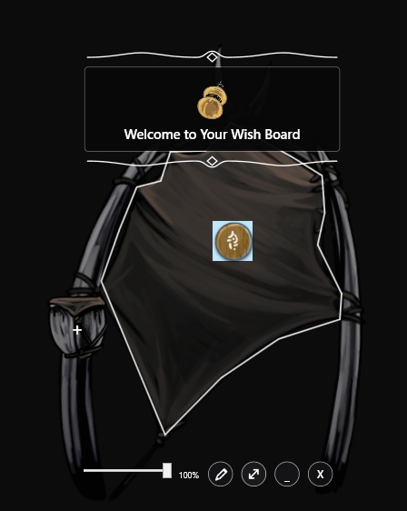 |
| Wishes stay inside the custom polygon and can be moved around the board. | Hovering over any badge shows the same centered preview position at the top. |

| Create a wish | Saving preview | Edit the board area |
| :---: | :---: | :---: |
| 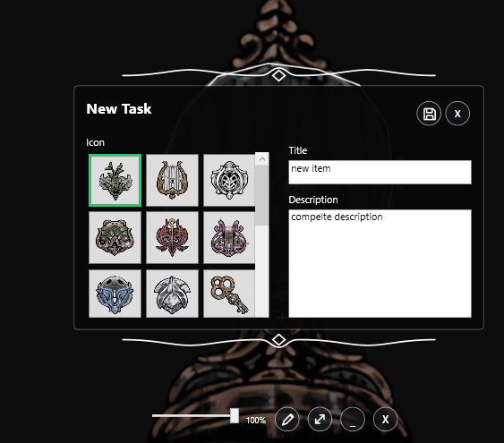 | 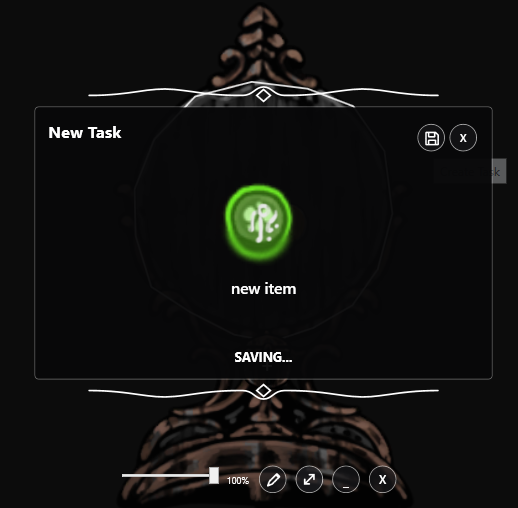 | 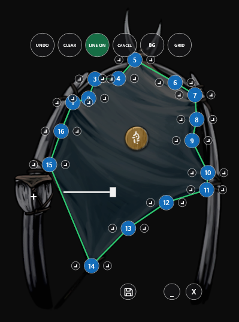 |
| Choose the internal icon and write the task. | The form becomes a live badge preview while placement is calculated. | Reshape the valid area node by node. |

## Board Profiles

The widget includes three fixed, selectable profiles. Each profile owns its background artwork, permitted task area, button placement and accessory configuration. Profile defaults can be restored without deleting the profile or its assets.

| Bone Bottom | Bellhart | Songclave |
| :---: | :---: | :---: |
|  | 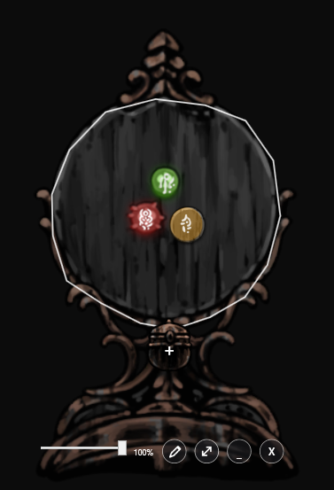 | 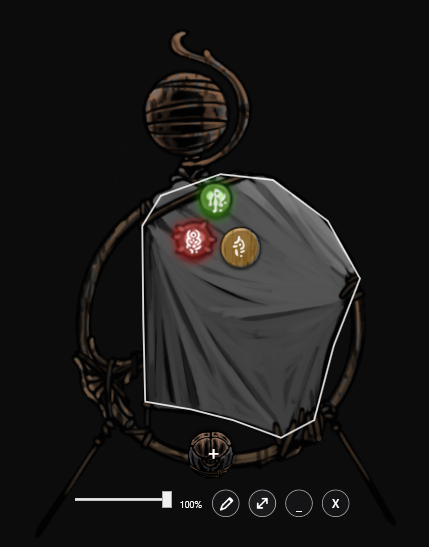 |
| A compact quest board with its own box accessory. | A covered town board with a movable pot accessory. | A wish wall with a movable tithe-box accessory. |

### Bone Bottom

<p align="center">
  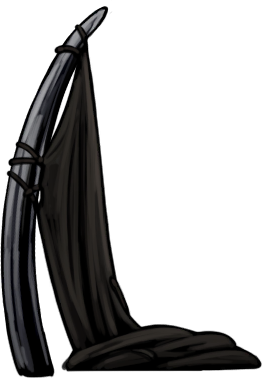
</p>

Bone Bottom is the default profile and the visual foundation of the badge system. Its task area follows the irregular shape of the fabric instead of using a rectangular hitbox.

Related assets:

- `src/backgrounds/BoneBotton/bonebottom_quest_board.png`
- `src/backgrounds/BoneBotton/bonebottom_quest_board_assemble.png`
- `src/backgrounds/BoneBotton/bonebottom_quest_board_box.png`
- `src/backgrounds/BoneBotton/profile.json`

### Bellhart

<p align="center">
  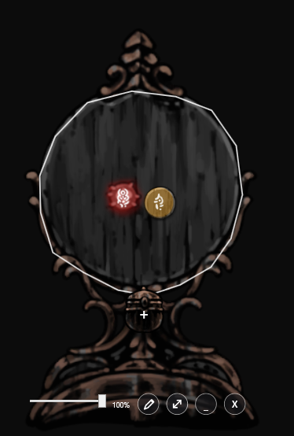
</p>

Bellhart provides a taller town-board composition with its own predefined polygon and a separate pot accessory that can be repositioned together with the `+` control.

Related assets:

- `src/backgrounds/BellHart/belltown_quest_board_larger.png`
- `src/backgrounds/BellHart/belltown_quest_board_covered.png`
- `src/backgrounds/BellHart/belltown_quest_board_pot.png`
- `src/backgrounds/BellHart/profile.json`

### Songclave

<p align="center">
  
</p>

Songclave uses the wish-wall artwork for both empty and populated states and includes a separate tithe box as its movable accessory.

Related assets:

- `src/backgrounds/SongClave/sc_wishwall.png`
- `src/backgrounds/SongClave/sc_wishwall_tithe_box.png`
- `src/backgrounds/SongClave/profile.json`

## Wishes, Badges and Labels

The icon selected while creating a wish is not displayed directly on the board. It remains available inside the hover preview, detail view and editor.

On creation, the widget permanently assigns:

- one random badge shape;
- one random white label;
- a vivid color associated with the selected icon;
- an independent pulsing-aura rhythm.

<p align="center">
  
  &nbsp;&nbsp;
  
  &nbsp;&nbsp;
  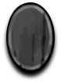
  &nbsp;&nbsp;
  
</p>

<p align="center">
  
  &nbsp;&nbsp;
  
  &nbsp;&nbsp;
  
  &nbsp;&nbsp;
  
</p>

Changing an existing wish keeps its badge and label. Changing its icon updates only the artificial badge color.

### Color Configuration

Every bundled icon has a predefined saturated color in:

`src/icons/colors.json`

Each entry references the icon ID, filename and hexadecimal color:

```json
{
  "id": "icon-07",
  "file": "icon-07.png",
  "color": "#267EED"
}
```

Edit the hexadecimal value to tune a color. New icons can be added manually to `src/icons.json`, stored in `src/icons/`, and mapped in `src/icons/colors.json`.

## Creating a Wish

Click the `+` control to open the ornamented creation panel.

<p align="center">
  
</p>

1. Select an icon.
2. Enter the title.
3. Add an optional description.
4. Click the disk icon in the upper-right corner.

While the widget calculates the new position, the form is replaced by a badge preview and `SAVING...`. Save and Cancel remain disabled until the operation finishes.

<p align="center">
  
</p>

The placement system starts at the geometric center of the permitted area and searches outward in small rings. Every candidate is checked against the complete polygon and all existing wishes. The first valid position closest to the center is selected.

If no valid position remains, the panel explains that the board is full, encourages finishing existing tasks, and closes automatically without creating partial data.

## New-Wish Aura

Every new wish receives a colored pulsing aura. Its timing and initial delay are randomized, so multiple new wishes pulse independently instead of moving in synchronization.

The aura remains active until the wish is clicked for the first time.

## Fixed Hover Preview

Hovering over a badge displays an ornamented preview inside the widget itself.

<p align="center">
  
</p>

The preview:

- is fixed at the top of the widget;
- is centered using the full widget width;
- adjusts its width to the title length;
- shows the original selected icon and title;
- never follows the pointer or the badge position;
- does not mark the wish as viewed.

## Detail View

Click a badge without dragging it to open the full ornamented detail window.

<p align="center">
  
</p>

The read view contains the original icon, title and description. Its upper-right controls provide Edit, Delete, Resize and Close actions.

In Edit Mode you can change:

- icon;
- title;
- description.

Saving an icon change recolors the board badge while preserving its randomly assigned shape and label.

## Moving Wishes

Drag a badge to reposition it.

The movement system:

- keeps the complete task hitbox inside the polygon;
- prevents badge collisions;
- uses a small spacing margin so more wishes fit naturally;
- attempts to slide around neighboring badges;
- persists the final position immediately.

## Board Edit Mode

The pencil button opens board-level editing. While active, wishes cannot be dragged.

<p align="center">
  
</p>

Edit Mode supports:

- selecting Bone Bottom, Bellhart or Songclave;
- moving existing polygon nodes;
- inserting new nodes between segments;
- undoing changes from the current session;
- restoring the active profile defaults;
- showing or hiding the boundary line;
- enabling or disabling automatic startup with Windows;
- moving and resizing the `+` control and accessory;
- changing the number of icons per row.

Save applies the session. Cancel restores the state captured before editing began.

## Start with Windows

Edit Mode includes a `STARTUP ON/OFF` control using the same visual state pattern as `LINE ON/OFF`.

- `STARTUP ON` means the widget will open automatically at the next Windows sign-in.
- `STARTUP OFF` means automatic startup is disabled.

Enabling it creates `Silksong Wish Board.lnk` in the current user's native Windows Startup folder. Disabling it removes that shortcut. The operation requires no administrator permission and no external dependency.

The shortcut points to `Desktop Wish Board.vbs` in the current project location. If the project directory is moved later, toggle Startup off and on again to recreate the shortcut with the new path.

## Widget Controls

The bottom toolbar contains:

| Control | Purpose |
| --- | --- |
| Transparency slider | Adjusts the opacity of the complete widget. |
| Pencil | Opens or saves Board Edit Mode. |
| Resize | Resizes the complete widget while preserving its proportions. |
| Minimize | Hides the widget in the system tray. |
| `X` | Closes the widget completely. |

Drag any unused part of the widget to move it around the Windows desktop. Position, size, monitor anchor and opacity are restored on the next launch.

## Requirements

- Windows 10 or Windows 11
- Windows PowerShell 5.1
- WPF and Windows Forms included with Windows
- No third-party runtime or installer

## Windows Security Warning

Windows may mark files downloaded through a browser as originating from the Internet.

### Cloning with Git

Cloning the repository normally does not apply the browser download mark, so the security warning is not expected:

```powershell
git clone YOUR_REPOSITORY_URL
```

### Downloading as ZIP

The recommended approach is to unblock the ZIP before extraction:

1. Right-click the downloaded ZIP and select **Properties**.
2. Enable **Unblock**.
3. Select **Apply** and extract the project.

If the ZIP was extracted without being unblocked, Windows may display a security warning on the first launch. This warning appears before the widget can execute any code, so it cannot be skipped automatically.

After you confirm **Open** once, the widget automatically removes the Internet download mark from files inside its own project directory. Future launches, including `STARTUP ON`, should no longer display that warning for the same extracted copy.

You can also unblock an already extracted copy manually by opening CMD in the project root and running:

```cmd
powershell.exe -NoProfile -Command "Get-ChildItem -LiteralPath . -Recurse -File | Unblock-File"
```

Only unblock files whose source you trust. See Microsoft's [Unblock-File documentation](https://learn.microsoft.com/powershell/module/microsoft.powershell.utility/unblock-file) and [Attachment Manager guidance](https://support.microsoft.com/windows/security/information-about-the-attachment-manager-in-microsoft-windows).

## Run

From the project root, double-click:

```text
Desktop Wish Board.vbs
```

The launcher starts PowerShell invisibly, so no terminal window remains open.

### Debug Mode

Open `src/start-debug.bat`, or run:

```powershell
cd src
powershell.exe -NoProfile -ExecutionPolicy Bypass -STA -File widget.ps1
```

### Stop a Running Instance

```powershell
cd src
stop-widget.bat
```

## Command Hub

The command hub is located at `src/package.json`. It does not install application dependencies; it only provides memorable aliases for native project commands.

```powershell
cd src
npm run run
npm run debug
npm run test
npm run lint
npm run build
npm run status
npm run help
```

## Project Structure

```text
silksong-wishboard-widget/
├── Desktop Wish Board.vbs
├── README.md
├── docs/
│   └── images/
│       └── *.png
└── src/
    ├── widget.ps1
    ├── config.json
    ├── area.json
    ├── tasks.json
    ├── profiles.json
    ├── icons.json
    ├── icons/
    │   ├── colors.json
    │   └── icon-*.png
    ├── backgrounds/
    │   ├── BoneBotton/
    │   ├── BellHart/
    │   ├── SongClave/
    │   └── badges/
    ├── package.json
    ├── start-debug.bat
    └── stop-widget.bat
```

## Persistent Data

| File | Stores |
| --- | --- |
| `src/tasks.json` | Wishes, badges, labels, colors, positions and viewed state. |
| `src/config.json` | Active profile, window placement, opacity and UI configuration. |
| `src/area.json` | Current polygon and task size. |
| `src/backgrounds/*/profile.json` | Profile assets and default layout. |
| `src/icons.json` | Available icons. |
| `src/icons/colors.json` | Saturated badge colors associated with icons. |

## Local and Deployed Use

This is a native desktop application, not a website.

- Local application: launched by `Desktop Wish Board.vbs`.
- Deployed website: not applicable.
- Distribution: copy or extract the complete project directory on Windows.

## Technology

- [PowerShell documentation](https://learn.microsoft.com/powershell/)
- [Windows Presentation Foundation](https://learn.microsoft.com/dotnet/desktop/wpf/)
- [Windows Forms](https://learn.microsoft.com/dotnet/desktop/winforms/)
- [JSON overview](https://www.json.org/json-en.html)

## Project Origin

This project began as an experiment to transform a conventional task list into something that feels like a physical wish board from a game world. It evolved into a configurable desktop application with custom artwork, themed profiles, animated task states, polygon-aware movement and persistent Windows integration.

It is a fan-made productivity project inspired by *Hollow Knight: Silksong* and is not affiliated with or endorsed by Team Cherry.
